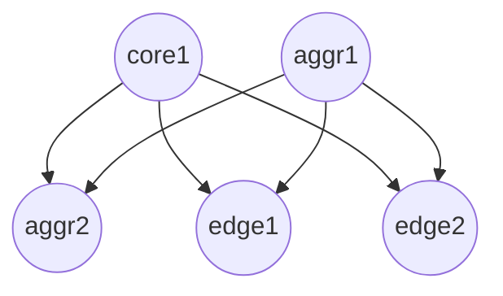

La topologia con la que se trabaja actualmente es la siguiente: 


Recordando que físicamente existe una conexión entre todos los switches hacia el controlador que se usara, esta conexión es desde el puerto 1 en todos los switches hacia el 1,2..., 5

Para lograr esto se usa un switch extra en el cual se conecta el controlador.

# Conectándose al switch 

Para conectarse al switch existen dos maneras, utilizar `ssh` o un cable de consola y conectarse físicamente a un puerto del switch controlador. 

## Conexión directa (Cable de consola) 

Una vez se conecta físicamente el cable es necesario instalar `micom` como se habla en la guía para luego ejecutar el siguiente comando en la terminal
```
sudo minicom -D /dev/ttyUSB0 -b 9600
```
Después de dejarlo cargar nos pedira un usuario y contraseña para finalmente entrar a la CLI del switch.

## Conexión con SSH 
Muy posiblemente si se intenta conectar mediante ssh usando la sintaxis: `ssh user@ip` desde un dispositivo Linux con alguna distribución actualizada aparezcan algunos errores por los algoritmo de criptografia que se usan para  el intercambio, una solucion en fedora es especificar que este use sistemas antiguos con el comando: 

```sh
sudo update-crypto-policies --set LEGACY 
```

Después de esto deberíamos poder tener una conexión exitosa con cualquier switch, sin embargo es muy recomendado regresar al estado anterior las políticas de criptografia una vez se cierra la sesión ssh, esto se hace con el comando:  

```sh
sudo update-crypto-policies --set DEFAULT
```

Ademas podemos verificar que política tenemos actualmente con el comando: 

```sh
update-crypto-policies --show 
```

> [!danger] El modo legacy usa algoritmos que se consideran inseguros, recuerda cambiar este modo siempre una vez se acabe de usar la conexión. 
> 

> [!todo] Actualizar la version de SSH en todos los switches para mejorar la seguridad de la red.


# Configuración del switch 

Cada switch a usar se debe configurar, siguiendo el paper, dado que esto ya esta hecho solo comprobé con algunos comandos esta configuración para entender mejor el panorama. 

Para mostar las instancias actuales en el switch se usa el comando:
```
show openflow 
```

En el caso del switch `core1` la salida es:
```
OpenFlow                     : Enabled
Egress Only Ports Mode       : Disabled

Instance Information

Instance Name        Oper. Status    No. of H/W Flows    No. of S/W Flows    OpenFlow Version
-------------------------------------------------------------------------------------------
1                    Down            0                   0                   1.0
tesis_sdn            Up              4                   1                   1.3
```

Para este caso se usa la instancia: `tesis_sdn`

Ademas para mostrar los controladores configurados se usa: 
```sh
show openflow controller
```

Siendo la salida:

```
Controller Information

Controller Id    IP Address      Hostname    Port    Interface
----------------------------------------------------------------
1                192.168.1.10    NA          6653    VLAN 1
10               192.168.1.2     NA          6633    VLAN 1
```

Mostrando que tenemos dos controladores configurados, en este caso el que se usara es el que tiene la id 1.

# Controlador OpenDayLight

Para usar OpenDayLight es necesario tenerlo descargado para luego entrar a la carpeta `bin` en la cual esta el ejecutable, para ejecutarlo se necesitan tener:
- la variable `JAVA_HOME` configurada correctamente
- Java version 17 o superior

> [!tip]- Versiones de Java
> Linux permite instalar varias versiones de Java al mismo tiempo, para cambiar entre ellas se puede usar el comando:
> ```sh
> sudo update-alternatives --config java
> ```
> Luego solo es necesario seleccionar la que queramos usar, en mi caso estoy usando Java 21 


Luego de ejecutar por primera vez ODL es necesario instalar los siguientes plugins para su correcto funcionamiento: 
- `odl-openflowplugin-flow-services-rest` 
- `odl-openflowplugin-app-table-miss-enforcer` 
- `odl-openflowplugin-nxm-extensions`

Se instalan con el comando:

```sh
feature:install odl-openflowplugin-flow-services-rest odl-openflowplugin-app-table-miss-enforcer odl-openflowplugin-nxm-extensions
```

Una vez listo se puede comprobar si existe conexión entre el switch con el controlador directamente desde el controlador usando el comando:

```sh
show-session-stats
```

La salida para este comando debe ser algo como:
```sh
SESSION : openflow:000000000000
 CONNECTION_CREATED : 1
```


> [!help] Para salir de ODL se usa el comando `logout`