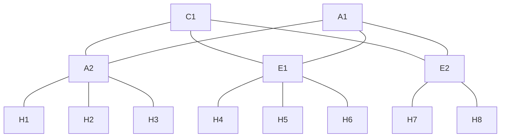

Todos los switches están conectados al controlador de ODL mediante su puerto `1`, ademas la IP del controlador es `192.168.1.10/24`. Cada controlador tiene configurada una VLAN para la red con las siguientes direcciones: 
```
Core1: 192.168.1.11/24 
Aggr1: 192.168.1.12/24
Aggr2: 192.168.1.13/24
Edge1: 192.168.1.14/24
Edge2: 192.168.1.15/24
```

La topologia física esta conectada de la siguiente manera: 

| Dispositivo | Interfaz | Dipositivo conectado |
| ----------- | -------- | -------------------- |
| `Core1`     | 2        | `Aggr1`              |
|             | 3        | `Edge1`              |
|             | 4        | `Edge2`              |
| `Aggr1`     | 2        | `Aggr2`              |
|             | 3        | `Edge1`              |
|             | 4        | `Edge2`              |
| `Aggr2`     | 2        | `Core1`              |
|             | 3        | `Aggr1`              |
|             | 13       | `H1`                 |
|             | 14       | `H2`                 |
|             | 15       | `H3`                 |
| `Edge1`     | 2        | `Core1`              |
|             | 3        | `Aggr1`              |
|             | 13       | `H4`                 |
|             | 14       | `H5`                 |
|             | 15       | `H6`                 |
| `Edge2`     | 2        | `Core1`              |
|             | 3        | `Aggr1`              |
|             | 13       | `H7`                 |
|             | 14       | `H8`                 |
Cada host tiene la dirección `10.0.0.X/24` siendo X el numero de host por ejemplo: `H1` tiene la dirección `10.0.0.1/24`