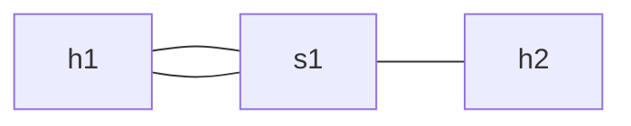
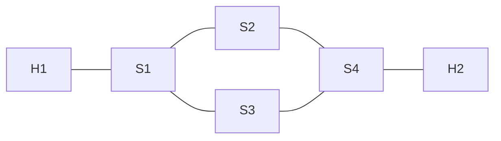

# How to divide packets into two or more equivalent paths?
## Load balance

If there is two links between two nodes probably we want to use both of them, this problem is easily solved if we were using traditional computer networks, but Software-Defined Networks we have to configure this from scratch this mean we need to use some Flow to define what link are the package take, using only Flows this seems almost imposible but OpenFlow give us a solution: [Groups](concepts/groups)  which have 4 types but the important one to this task is the Select Group, which allow us to get many ports and select one of them an send the package using the selected port, the mechanism to make this is programmed by each Switch manufacturer. 

Imagine you have the example where `H1` has two links to `S1` and `S1` has one link yo `H2`, for this example `H1` has the IP 192.168.1.100 and `H2` has 192.168.2.100, this mean when only can install one Flow at `S1` to send package from one side to another but instead of adding a port as output we add a groups that have to be configured as Select type and added all the ports to the buckets, this groups use a property called weight this has a different approach depending on the switch we are using

**WARNING**: The switch must accept the Select type groups, and the functionality depends on the manufacturer.

**WARNING**: Aruba 2930F switches don't accept this group type using hardware which make this approach non-viable for a simple use. 

## Multiple paths

Another common problem is the redundancy, if we have two paths similar we can use one main path as the main and the other as a backup just in case some port or the switch are down. 

The groups Fast Fail Over allow us to  check if a port is receiving connected and use different ports using this information, in this case we can add the port to `S2` as primary and only in case the port is down use the `S3` port. We can install the normal paths but changing the output port on `S1` and `S4` for a group.

**WARNING**: The switch must accept the Select type groups.

**WARNING**: Aruba 2930F switches don't accept this group type using hardware which make this approach non-viable for a simple use.
## Other approaches 

This examples were using Groups defined by OpenFlow but also has Meters which can, in theory, be used for this purpose.

Another way to do this is have a monitor that getting information from the ODL controller reconfigure the flows in real-time but this approach has not been tested. 