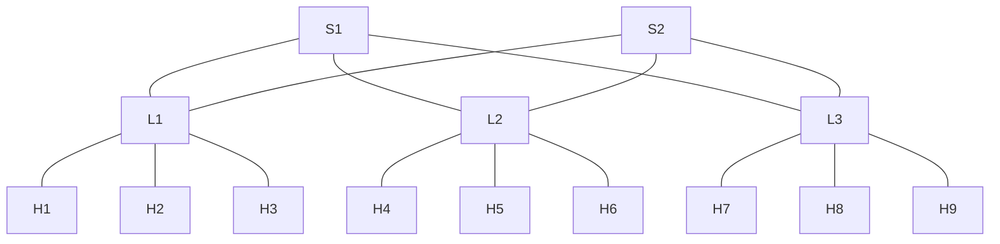
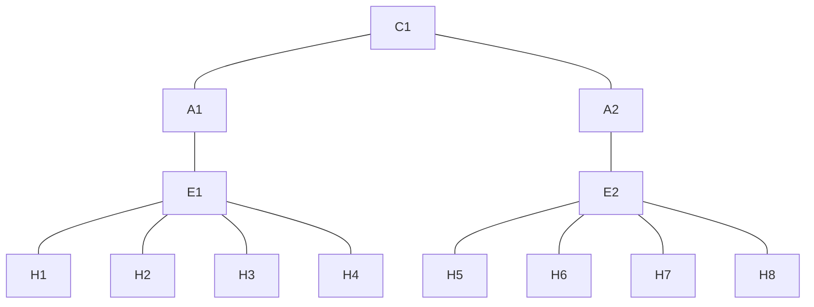

# Miguel's Experiments

> This note documents how the experiments for the article **"INSERT NAME HERE"**.

This experiments where created using 2 different topologies: Spine Leaf and 3 layers hierarchical topology, both tested in an physical  and also a simulation environment created with Mininet. This experiments are realized using the OpenFlow capabilities of the Aruba 2930F JL263A (or OVSwitch in case of Mininet) Switches, connected to a OpenDayLight controller.

## Topology

### Spine leaf 

| Device | Interface | Connected Device | Connected Device IP |
| ------ | --------- | ---------------- | ------------------- |
| `S1`   | 2         | `L1`             |                     |
|        | 3         | `L2`             |                     |
|        | 4         | `L3`             |                     |
| `S2`   | 2         | `L1`             |                     |
|        | 3         | `L2`             |                     |
|        | 4         | `L3`             |                     |
| `L1`   | 2         | `S1`             |                     |
|        | 3         | `S2`             |                     |
|        | 13        | `H1`             | 10.0.1.1/16         |
|        | 14        | `H2`             | 10.0.1.2/16         |
|        | 15        | `H3`             | 10.0.1.3/16         |
| `L2`   | 2         | `S1`             |                     |
|        | 3         | `S2`             |                     |
|        | 13        | `H4`             | 10.0.2.1/16         |
|        | 14        | `H5`             | 10.0.2.2/16         |
|        | 15        | `H6`             | 10.0.2.3/16         |
| `L3`   | 2         | `S1`             |                     |

The configuration for this topology using ODL got at least this type of Flows which are for this experiment the at least necessary to move the packages using IPv4: 
- **ARP**: This protocol must to be configured in all leaf switches and one of the spine switch to prevent the network to generate a broadcast storm, the flow must match any package which Ethernet type are ARP and flood this package.
- **Spine-Leaf**: Each Leaf switch has his own subnet, so in the spine switch this flow have to redirect all the traffic which income from any of the leaf switch to the correct leaf, each spine have to get one flow for each subnet (leaf switch) connected.
- **Leaf-Spine**: This flow is one of the most critical, one of the main advantages of spine leaf is the reliability of the links and the bandwidth this is achieved using a load balance on the multiple links from leaf to the spine, sadly non of this feature are available on the Aruba Switch this issue is detailed in this note: [multipaths](multipaths.md), anyway for this experiment the "load balance" was made just separating the flows depending on the IP directions (This is not the best solution, but is the only available), one flow is needed for each spine switch.
- **Leaf-Host**: This last flow only need to move the incoming package to the correct port connected with one host, obviously each host connected need his own flow. 

## 3 layers hierarchical topology 

| Device | Port | Connected Device | Connected Device IP |
| ------ | ---- | ---------------- | ------------------- |
| C1     | 2    | A1               |                     |
|        | 3    | A2               |                     |
| A1     | 2    | C1               |                     |
|        | 3    | E1               |                     |
| A2     | 2    | C1               |                     |
|        | 3    | E1               |                     |
| E1     | 2    | A1               |                     |
|        | 13   | H1               | 10.0.1.1/16         |
|        | 14   | H2               | 10.0.1.2/16         |
|        | 15   | H3               | 10.0.1.3/16         |
|        | 16   | H4               | 10.0.1.4/16         |
| E2     | 2    | A2               |                     |
|        | 13   | H5               | 10.0.2.1/16         |
|        | 14   | H6               | 10.0.2.2/16         |
|        | 15   | H7               | 10.0.2.3/16         |
|        | 16   | H8               | 10.0.2.4/16         |
|        | 17   | H9 - test        | 10.0.2.5/16         |
|        | 18   | H10-test         | 10.0.2.6/16         |

The configuration of this topology is really simple, only the next flows are necessary: 

- **ARP**: the same flow that is configured in the spine leaf, but in this case this flow must be configured in all the switches.
- **From Core to Aggregation layer** and **from Aggregation to Edge layer** this flow only need to move the incoming package from one port to the other.
- **Edge to Hosts**: The same that the spine leaf, one flow for each host connected in the Edge switch. 