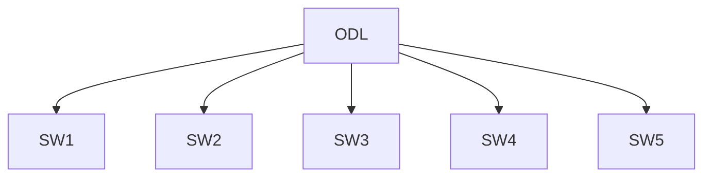

# ODL and Switch configuration

The ODL controller must to be connected physically with all the switched in the network, in this case we have 5 Aruba Switches so we connect the controller  and switch's to a non-configurable switch. 



All the switch's are using the port 1 to connected with the controller but you can use any port just be sure that port is already configured with the correct IP and VLAN on each switch. The Switches IP's are:

```
SW1: 192.168.1.11/24 
SW2: 192.168.1.12/24
SW3: 192.168.1.13/24
SW4: 192.168.1.14/24
SW5: 192.168.1.15/24
```

And the controller IP must to be
```
ODL: 192.168.1.10/24
```

## Configuración del switch 

Cada switch a usar se debe configurar, siguiendo el paper, dado que esto ya esta hecho solo comprobé con algunos comandos esta configuración para entender mejor el panorama. 

Para mostar las instancias actuales en el switch se usa el comando:
```
show openflow 
```

En el caso del switch `core1` la salida es:
```
OpenFlow                     : Enabled
Egress Only Ports Mode       : Disabled

Instance Information

Instance Name        Oper. Status    No. of H/W Flows    No. of S/W Flows    OpenFlow Version
-------------------------------------------------------------------------------------------
1                    Down            0                   0                   1.0
tesis_sdn            Up              4                   1                   1.3
```

Para este caso se usa la instancia: `tesis_sdn`

Ademas para mostrar los controladores configurados se usa: 
```sh
show openflow controller
```

Siendo la salida:

```
Controller Information

Controller Id    IP Address      Hostname    Port    Interface
----------------------------------------------------------------
1                192.168.1.10    NA          6653    VLAN 1
10               192.168.1.2     NA          6633    VLAN 1
```

Mostrando que tenemos dos controladores configurados, en este caso el que se usara es el que tiene la id 1.
