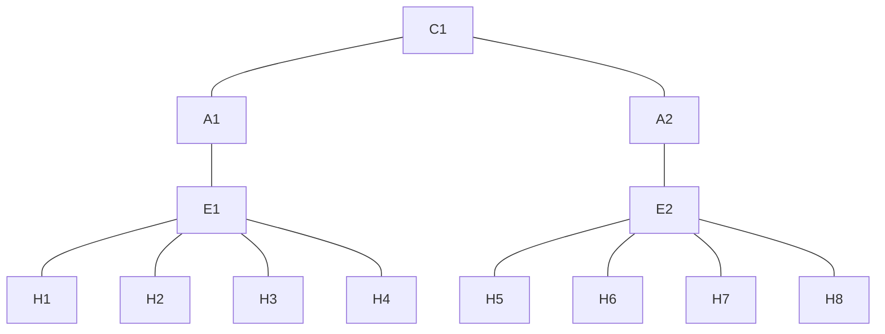

# Fat-Tree Topology


| Device | Port | Connected Device | Connected Device IP |
| ------ | ---- | ---------------- | ------------------- |
| C1     | 2    | A1               |                     |
|        | 3    | A2               |                     |
| A1     | 2    | C1               |                     |
|        | 3    | E1               |                     |
| A2     | 2    | C1               |                     |
|        | 3    | E1               |                     |
| E1     | 2    | A1               |                     |
|        | 13   | H1               | 10.0.1.1/16         |
|        | 14   | H2               | 10.0.1.2/16         |
|        | 15   | H3               | 10.0.1.3/16         |
|        | 16   | H4               | 10.0.1.4/16         |
| E2     | 2    | A2               |                     |
|        | 13   | H5               | 10.0.2.1/16         |
|        | 14   | H6               | 10.0.2.2/16         |
|        | 15   | H7               | 10.0.2.3/16         |
|        | 16   | H8               | 10.0.2.4/16         |
|        | 17   | H9 - test        | 10.0.2.5/16         |
|        | 18   | H10 - test       | 10.0.2.6/16         |
## Configuration
- **ARP**
```json
{
  "id": "0000",
  "table_id": 0,
  "priority": 100,
  "match": {
    "ethernet-match": {
      "ethernet-type": {
        "type": 2054
      }
    }
  },
  "instructions": {
    "instruction": [
      {
        "order": 0,
        "apply-actions": {
          "action": [
            {
              "order": 0,
              "output-action": {
                "output-node-connector": "NORMAL"
              }
            }
          ]
        }
      }
    ]
  },
}

```

- **From Core to Aggregation layer**
```json
{
  "id": "102",
  "table_id": 0,
  "priority": 100,
  "cookie_mask": "0",
  "flow-name": "aggr-1",
  "idle-timeout": 0,
  "hard-timeout": 0,
  "match": {
    "ethernet-match": {
      "ethernet-type": {
        "type": 2048
      }
    },
    "ipv4-destination": "10.0.2.0/24"
  },
  "cookie": "0",
  "instructions": {
    "instruction": [
      {
        "order": 0,
        "apply-actions": {
          "action": [
            {
              "order": 0,
              "output-action": {
                "output-node-connector": "3"
              }
            }
          ]
        }
      }
    ]
  },
}

```

- **From Aggregation to Edge layer**
```json
{
  "id": "301",
  "table_id": 0,
  "priority": 100,
  "match": {
    "ethernet-match": {
      "ethernet-type": {
        "type": 2048
      }
    },
    "ipv4-destination": "10.0.1.0/24"
  },
  "instructions": {
    "instruction": [
      {
        "order": 0,
        "apply-actions": {
          "action": [
            {
              "order": 0,
              "output-action": {
                "output-node-connector": "3"
              }
            }
          ]
        }
      }
    ]
  },
}

```


- **Edge to Hosts**
```json
{
  "id": "401",
  "table_id": 0,
  "priority": 100,
  "match": {
    "ethernet-match": {
      "ethernet-type": {
        "type": 2048
      }
    },
    "ipv4-destination": "10.0.1.1/32"
  },
  "instructions": {
    "instruction": [
      {
        "order": 0,
        "apply-actions": {
          "action": [
            {
              "order": 0,
              "output-action": {
                "max-length": 0,
                "output-node-connector": "13"
              }
            }
          ]
        }
      }
    ]
  },
}

```