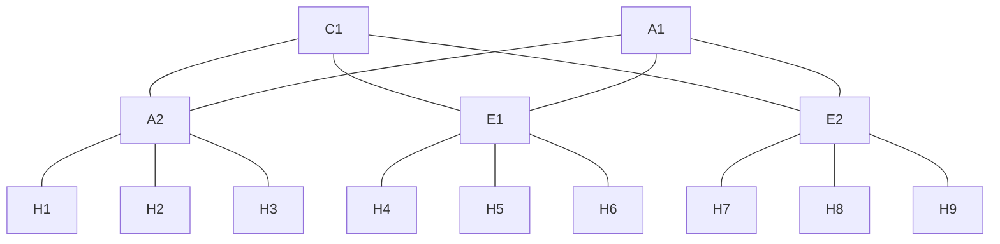

# Topología Spine Leaf



| Device  | Interface | Connected Device | Connected Device IP |
| ------- | --------- | ---------------- | ------------------- |
| `S1` | 2         | `L1`          |                     |
|         | 3         | `L2`          |                     |
|         | 4         | `L3`          |                     |
| `S2` | 2         | `L1`          |                     |
|         | 3         | `L2`          |                     |
|         | 4         | `L3`          |                     |
| `L1` | 2         | `S1`          |                     |
|         | 3         | `S2`          |                     |
|         | 13        | `H1`             | 10.0.1.1/16         |
|         | 14        | `H2`             | 10.0.1.2/16         |
|         | 15        | `H3`             | 10.0.1.3/16         |
| `L2` | 2         | `S1`          |                     |
|         | 3         | `S2`          |                     |
|         | 13        | `H4`             | 10.0.2.1/16         |
|         | 14        | `H5`             | 10.0.2.2/16         |
|         | 15        | `H6`             | 10.0.2.3/16         |
| `L3` | 2         | `S1`          |                     |
|         | 3         | `S2`          |                     |
|         | 13        | `H7`             | 10.0.3.1/16         |
|         | 14        | `H8`             | 10.0.3.2/16         |
|         | 15        | `H9`             | 10.0.3.3/16         |

## Configuration
- **ARP**: This protocol must to be configured in all switch's except on one of the Spine switch's to prevent a package storm. 
```json
// ARP on Switch 5
{
  "id": "5000",
  "flow-name": "arp",
  "table_id": 100,
  "match": {
    "ethernet-match": {
      "ethernet-type": {
        "type": 2054
      }
    }
  },
  "priority": 100,
  "instructions": {
    "instruction": [
      {
        "order": 0,
        "apply-actions": {
          "action": [
            {
              "order": 0,
              "output-action": {
                "output-node-connector": "NORMAL"
              }
            }
          ]
        }
      }
    ]
  }
}

```

- **Spine-Leaf**: the spine distribution work with sub networks since each of the switch's connected on port have his own, in fact you only need to install this on switch 1.
```json
// Spine-leaf on Switch 1 to Leaf 1 (switch 3 on port 2)
{
  "id": "101",
  "flow-name": "leaf-1",
  "table_id": 100,
  "match": {
    "ethernet-match": {
      "ethernet-type": {
        "type": 2048
      }
    },
    "ipv4-destination": "10.0.1.0/24"
  },
  "priority": 100,
  "instructions": {
    "instruction": [
      {
        "order": 0,
        "apply-actions": {
          "action": [
            {
              "order": 0,
              "output-action": {
                "output-node-connector": "2"
              }
            }
          ]
        }
      }
    ]
  }
}

```

- **Leaf-Host**
```json 
{
  "id": "201",
  "flow-name": "host-1",
  "table_id": 100,
  "match": {
    "ethernet-match": {
      "ethernet-type": {
        "type": 2048
      }
    },
    "ipv4-destination": "10.0.2.1/32"
  },
  "priority": 100,
  "instructions": {
    "instruction": [
      {
        "order": 0,
        "apply-actions": {
          "action": [
            {
              "order": 0,
              "output-action": {
                "output-node-connector": "13"
              }
            }
          ]
        }
      }
    ]
  }
}

```

- **Leaf-Spine**
```json
{
  "id": "500",
  "flow-name": "spine-1",
  "table_id": 100,
  "match": {
    "ethernet-match": {
      "ethernet-type": {
        "type": 2048
      }
    },
    "ipv4-destination": "10.0.0.0/16"
  },
  "priority": 90, // must to be lower than host flows
  "instructions": {
    "instruction": [
      {
        "order": 0,
        "apply-actions": {
          "action": [
            {
              "order": 0,
              "output-action": {
                "output-node-connector": "2"
              }
            }
          ]
        }
      }
    ]
  }
}

```